<h1 align="center"> Coding Pari Na Documention </h1><br>
<h6 align="Center">

[](https://www.python.org/)
 [](https://git-scm.com) [](https://visualstudio.microsoft.com) [](https://htmx.org/) [](https://www.javascript.com/) [](https://getbootstrap.com/docs/3.4/)

</h6>

<h4 align="center">
<a href="https://github.com/yeazin/Project-Coding-Pari-Na#-project-installation-"> Authentication</a> | 
<a href="https://github.com/yeazin/Project-Coding-Pari-Na#project-flow"> Khoj the Search </a>
|<a href="https://github.com/yeazin/Project-Coding-Pari-Na#-project-documention-"> API Endpoint </a>

</h4> 

<h2 align="center">Authentication</h2>

#### Sign Up
```bash
    A user can Sign up to System using : 
        - Full Name 
        - Phone Number (Unque)
        - Password 
        - Confirm Password
```
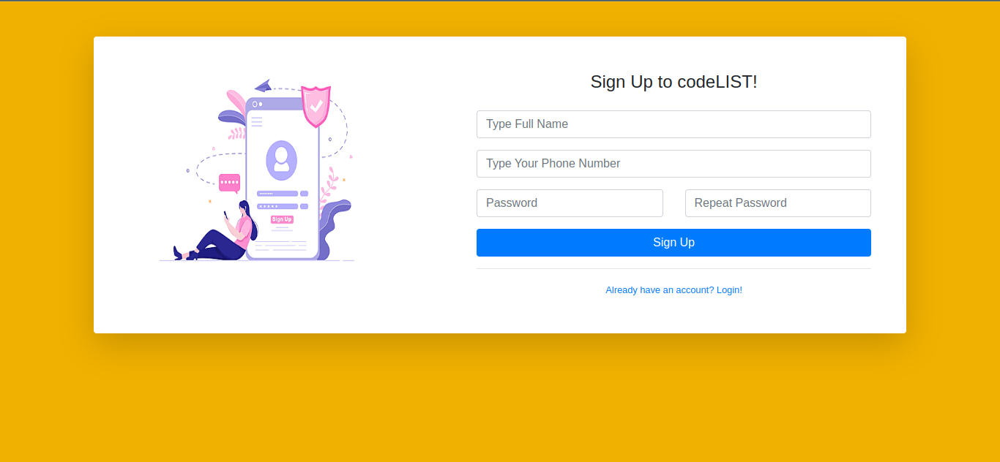
```bash 
    Error Will show if Phone Number is not Unque
    Otherwise it will show available

    NB : We use HTMX for this functionality 
```
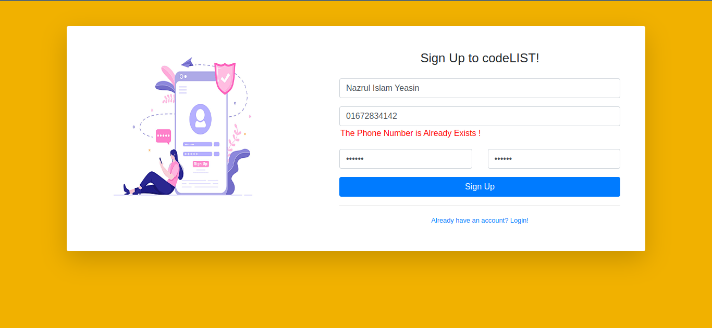
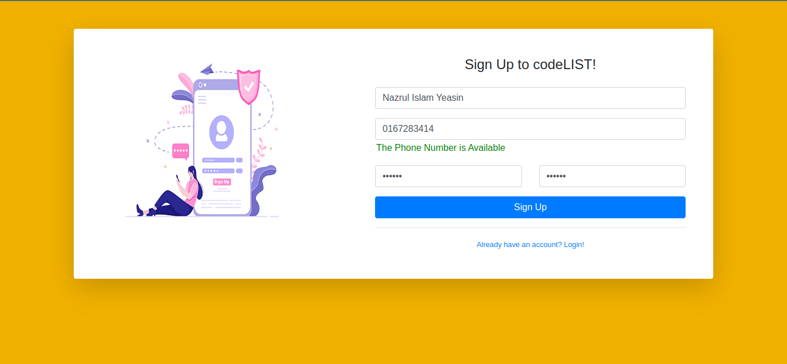

#### Login 
```bash 
    User can login to the system using 
        - Username or Phone number
        - Password
```
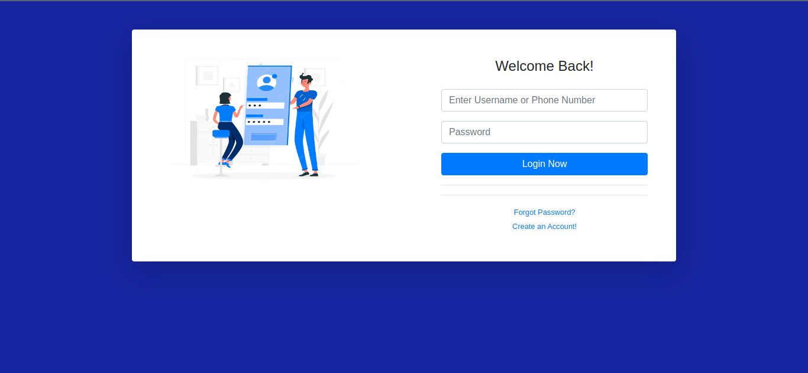

<h2 align="center">Khoj the Search</h2>

```bash 
    NB : The followings functionalities are for only authenticated user . If User is not authentiated then the system will redirect user on  the login page 
```

#### Dashboard 

<br>
After logged in the user will be redirect to his/her dashboard <br>
All the input values he/she ever created will appear here.
<br>

```bash 
    Dashboard Without List Input Data
```
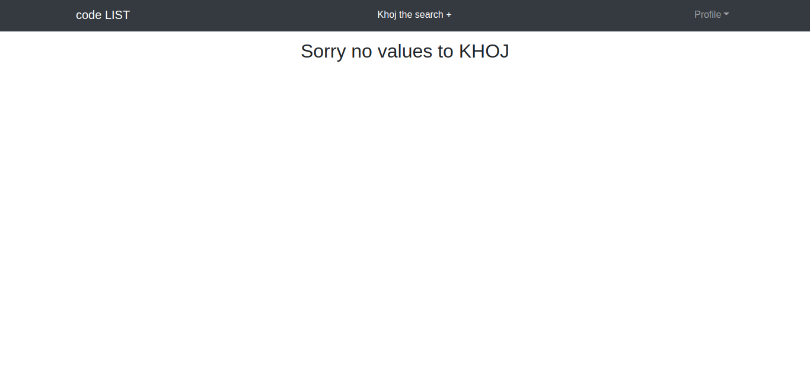
```bash 
    Dashboard with List input Data
```
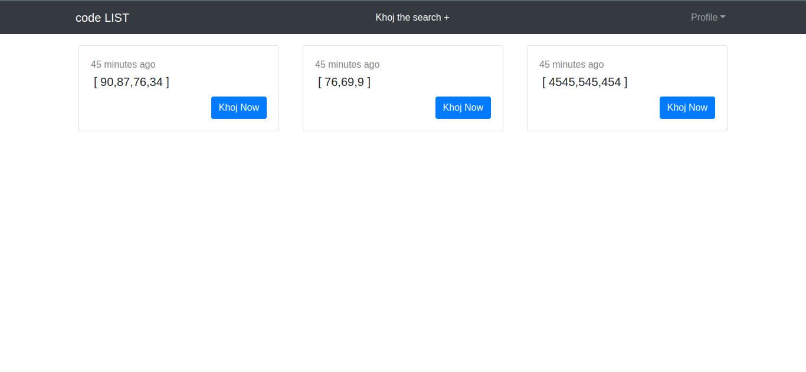

#### Khoj the Search List Input 
<br>
The User can create (Khoj) list from the menu <strong>Khoj the Search + </strong>. A pop will appear on the screen . User can create the a list with a search value. 
<br>

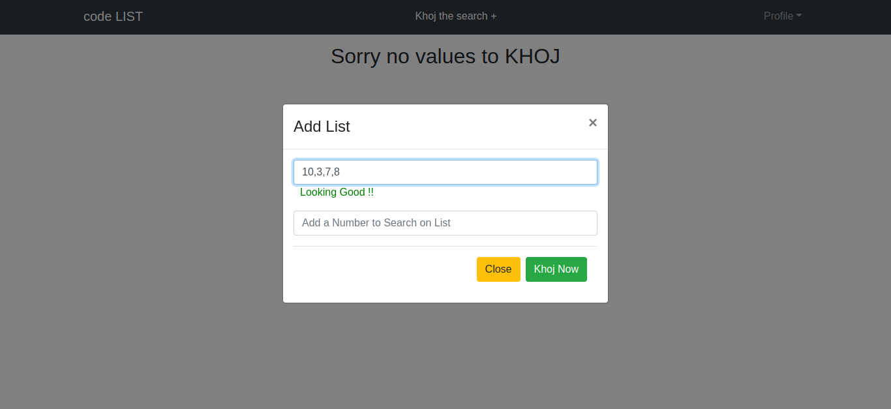

#### Errors handle 
```bash 
    If the User type any character other then number 
    it will show a "number error"
```

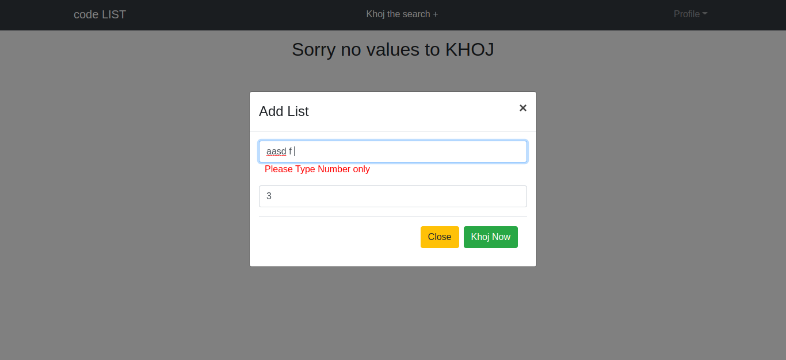

```bash
    If the user type comma (,) on first or last of the list 
    it will show a "single seperated comma error"
```

```bash
    If the user type double comma (,) on the list 
    it will show a "Double comma error"
```
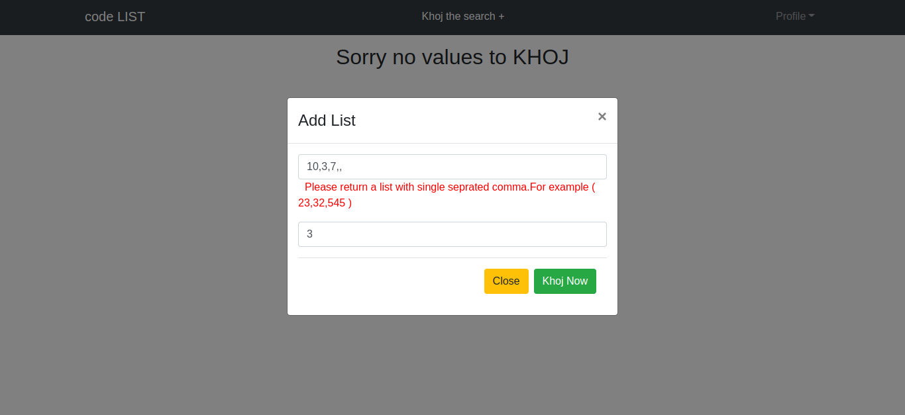

```bash
    In short this list input field will take a proper integer list .
    No matter what , It won`t take any unnecessary input.
```

#### Khoj the Single 

After pressing khoj button the input list will be stored in database <br> along with the <strong>current User</strong> and <strong>Created time</strong> and will be redirected <br> in a single page where the input list will be in <strong>Descending Order </strong><br> and the search will be in input fields. The result will be shown below. <br>
If the search value be found in list it will return <strong>True</strong> otherwise it will return <strong>False</strong>. The image being shown below . 

```bash 
    Result True when search value in the list 
```
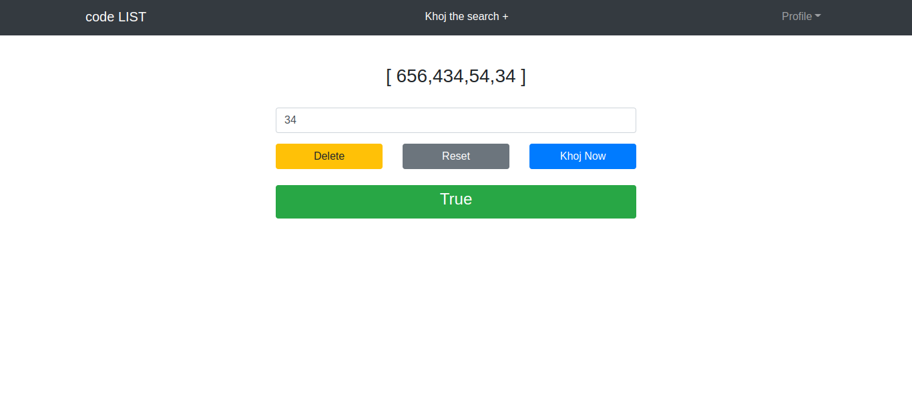
```bash 
    Resutl False when search value not in the list 
```
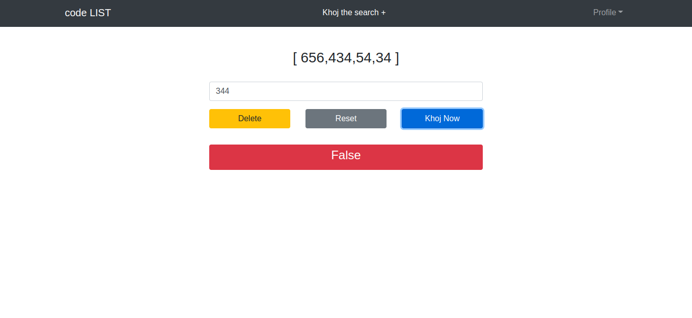

```bash 
    Here we will be demonstrating on how we solve the solution of khoj the search .
    
        - After Pressing the Khoj now button from the pop-up 
          the backend takes input list, current user and created time 
          to store them in database. 
          The search value then save to localstorage of the browser with 
          a key ,value
        
        - As we redirect the user in a single page of created list , we made a JS
          logics like when the page is loaded we check if there is a value in the localstorage 
          we saved before . IF there is then we simply did some JS logics again to search the value
          in the list and return the result based on being found or not. 
          If there is not then we simple return the single page . 

        - We can also check by giving as many as search value again again to serach on the 
          on the list in the single page. 
```


<h2 align="center">API Endpoint</h2>